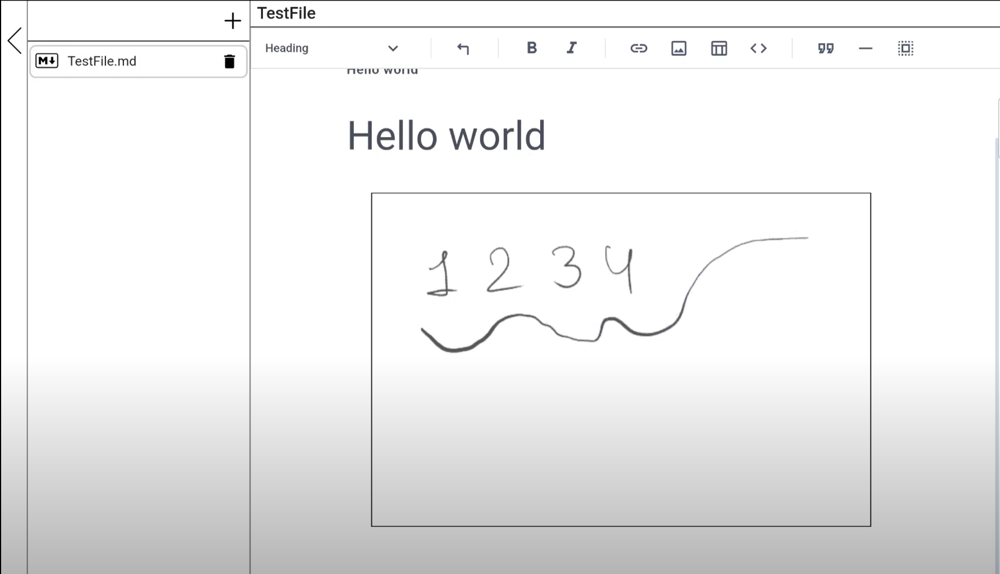

# Markdown Editor

- Основано на [milkdown](https://github.com/Saul-Mirone/milkdown)

## Причина создания

- Я хочу писать текст и комфортно делать рукописные рисунки на андроид планшете или прямо в браузере
- Не хочу быть зависимым от какого-либо формата и писать в обычном md
- Возможность экспорта в [obsidian.md](https://obsidian.md/) и любые другие популярные редакторы

### Versions

### v0.0.1

